<div align="center">

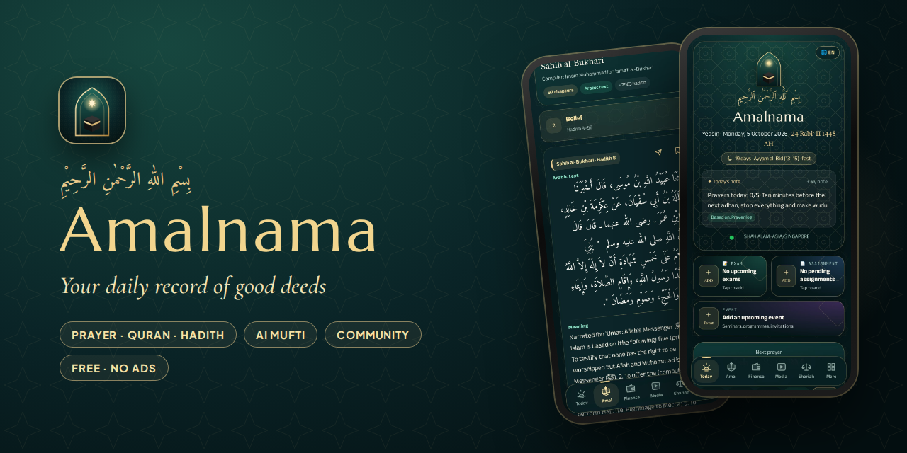

# Amalnama

**Your daily record of good deeds.**
Prayer times with azan, the Quran, the six authentic hadith collections, an AI mufti, Islamic media, a WhatsApp‑style community and a halal finance planner, all in one free, installable web app.

[](https://uowyeasin-cyber.github.io/AmalnamaForever/)
[](#install)
[](#languages)

[](https://github.com/uowyeasin-cyber/AmalnamaForever/actions/workflows/checks.yml)
[](https://github.com/uowyeasin-cyber/AmalnamaForever/actions/workflows/videos.yml)
[](LICENSE)


[Features](#features) · [Screenshots](#screenshots) · [Install](#install) · [Architecture](#architecture) · [Run locally](#run-locally) · [Deploy](#deploy-your-own) · [Privacy](#privacy--security) · [Contributing](CONTRIBUTING.md)

</div>

---

## Why Amalnama?

Most Muslims juggle five different apps for prayer times, Quran, hadith, budgeting and group chats. Amalnama brings them together in one calm place, with no ads, no tracking and no sign-up needed to start. It works offline, installs from the browser in one tap, and speaks Bangla, English, Melayu, Arabic, Urdu and Kiswahili.

## Features

| | |
|---|---|
| 🕌 **Azan & next prayer** | Live countdown to the next salah, azan with a choice of muezzin, prayer times from GPS or city (AlAdhan), or your own mosque times. |
| 📖 **The Holy Quran** | All 114 surahs in Uthmani and IndoPak (Nurani) script, choice of qari, bookmarks, background recitation. |
| 📚 **Sihah Sittah** | The six authentic hadith books, Arabic text with meaning, chapter by chapter. |
| 🤖 **Online Mufti (AI)** | Ask in your own language and get a short answer citing the Quran and authentic hadith (Gemini through Firebase AI Logic). Clearly labelled as an AI assistant, not a human mufti. |
| 🎬 **Islamic media** | Recitations, lectures and history from 23 trusted YouTube channels, refreshed every 6 hours by a GitHub Action and picked by prayer time. |
| 💬 **Community** | Instagram‑style posts plus WhatsApp‑style one‑to‑one chats, **groups**, voice/video calls and **group calls (up to 8)**. Calls and messages ring even when the app is closed (Web Push). |
| 💰 **Halal finance planner** | Academic, personal and business budgets, saving goals, upcoming‑bill reminders and a one‑tap audit report. |
| 🧮 **Zakat calculator** | Gold or silver nisab, cash, business stock, receivables and debts. |
| 📕 **Masail library** | Bahishti Zewar, Riyad as‑Salihin, Fiqh us‑Sunnah and more, readable inside the app in several languages. |
| ✅ **Daily routine** | Ibadah tracker, classes, study, to‑dos, exams and assignments, Pomodoro focus, screen time, Hijri date and Islamic days. |
| 📅 **Google Calendar & Drive** | Optional: everything you add becomes a Calendar reminder (and is removed when you delete it); your data syncs between laptop and phone through your own Google Drive. |
| 🌙 **Thoughtful details** | Animated launch, three‑step first‑run setup, smooth on low‑end phones, back button and refresh keep your place. |

## Screenshots

<div align="center">
<table>
<tr>
<td align="center">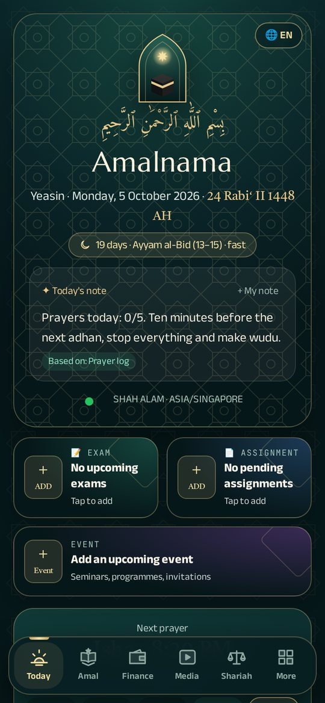<br><sub><b>Today</b></sub></td>
<td align="center">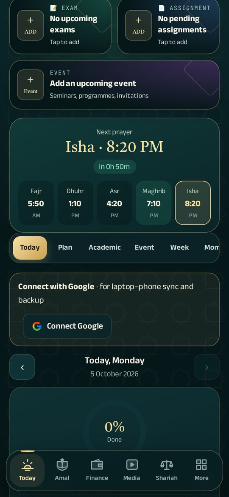<br><sub><b>Next prayer</b></sub></td>
<td align="center">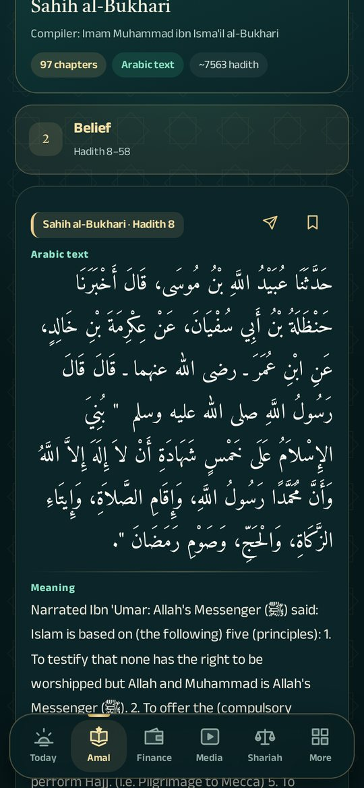<br><sub><b>Sihah Sittah</b></sub></td>
<td align="center">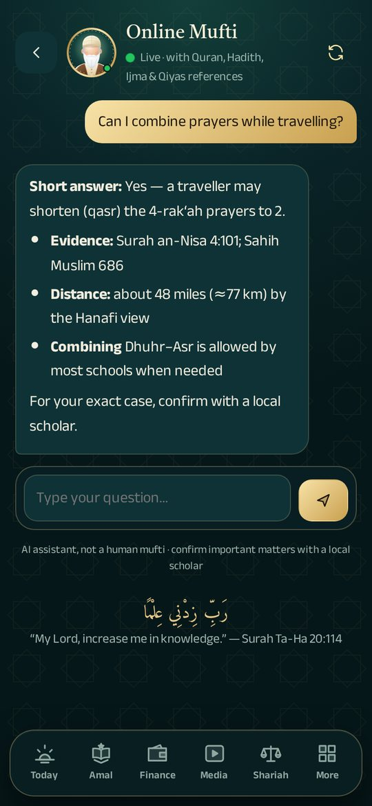<br><sub><b>Online Mufti</b></sub></td>
</tr>
<tr>
<td align="center">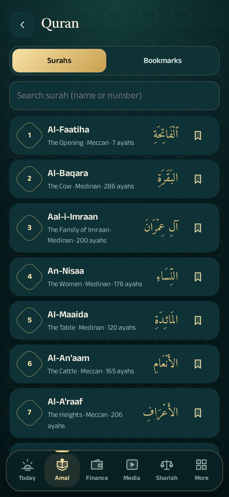<br><sub><b>Quran</b></sub></td>
<td align="center">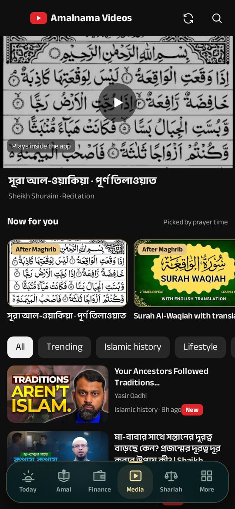<br><sub><b>Media</b></sub></td>
<td align="center">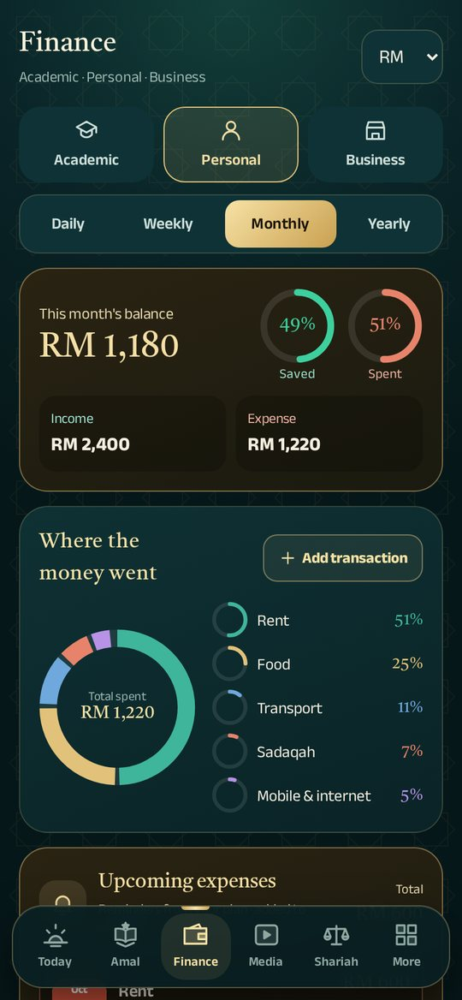<br><sub><b>Finance</b></sub></td>
<td align="center">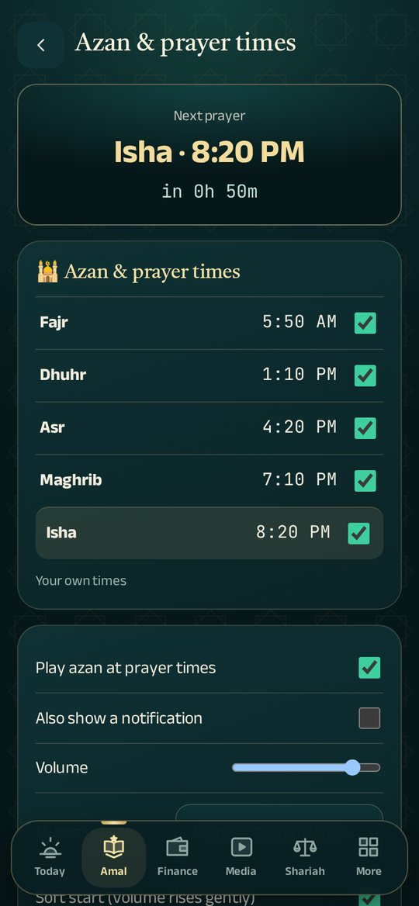<br><sub><b>Azan</b></sub></td>
</tr>
<tr>
<td align="center">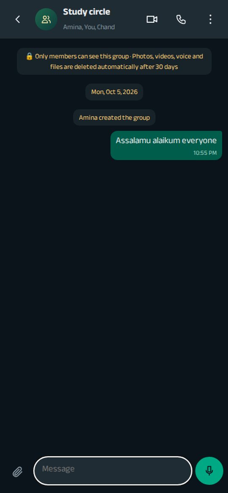<br><sub><b>Group chat</b></sub></td>
<td align="center">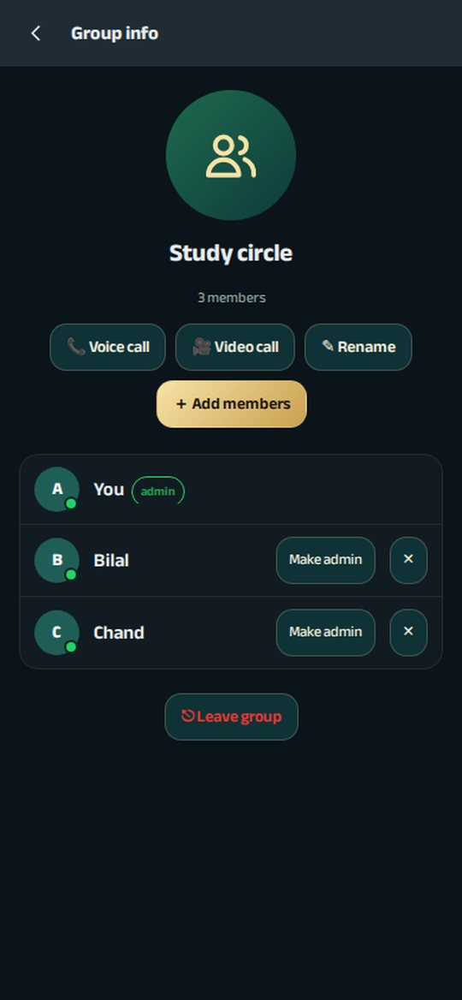<br><sub><b>Group info</b></sub></td>
<td align="center">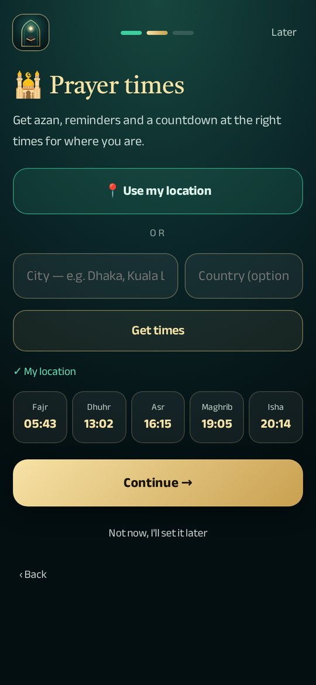<br><sub><b>First‑run setup</b></sub></td>
<td align="center">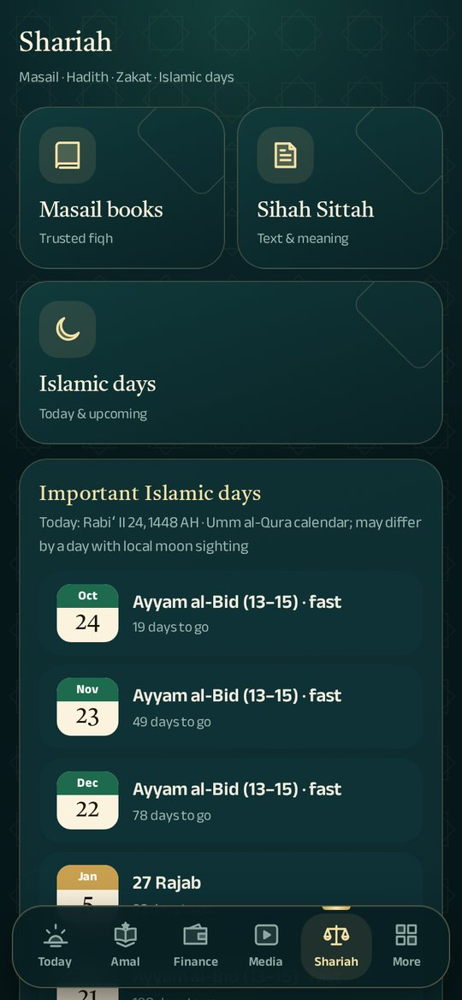<br><sub><b>Shariah</b></sub></td>
</tr>
</table>
</div>

## Install

Amalnama is a Progressive Web App: no app store needed.

| Device | How |
|---|---|
| **Android** (Chrome) | Open the [app](https://uowyeasin-cyber.github.io/AmalnamaForever/) → **Install** (or ⋮ → *Add to Home screen*). |
| **iPhone / iPad** (Safari, iOS 16.4+) | Open the app → **Share** → **Add to Home Screen**. |
| **Windows / macOS** (Chrome, Edge) | Open the app → install icon in the address bar. |

A printable brochure with a QR code is in [`Amalnama-Brochure.pdf`](Amalnama-Brochure.pdf).

## Languages

বাংলা · English · Bahasa Melayu · العربية · اردو · Kiswahili. The interface, dates (including Hijri month names) and the AI answers follow the chosen language; Arabic and Urdu use right‑to‑left layout.

## Architecture

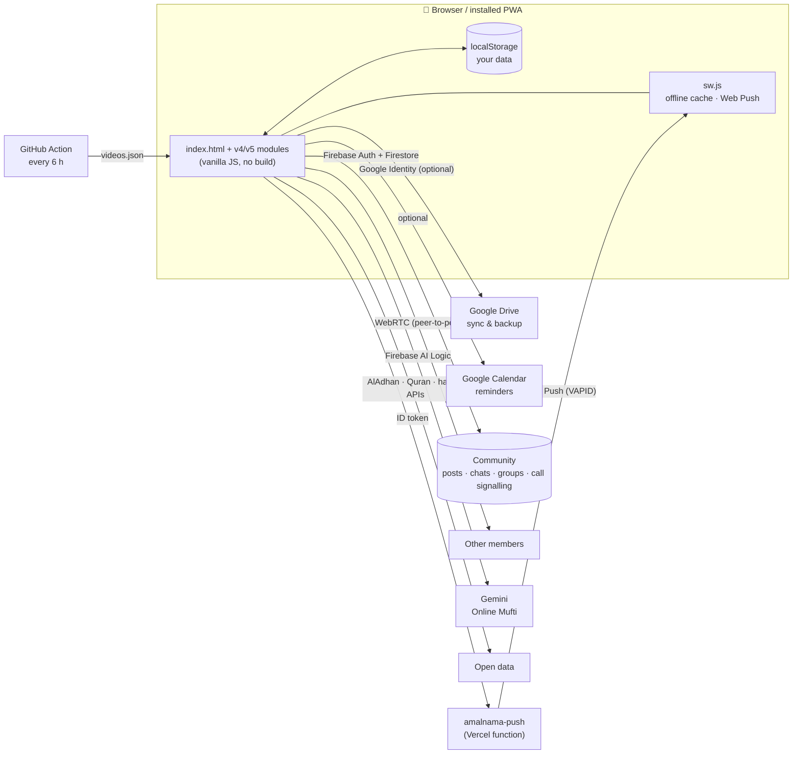

* **No build step.** Plain HTML, CSS and JavaScript served by GitHub Pages. Each feature is a small self‑contained module that extends the previous one.
* **Your data stays yours.** Routine, finance and notes live in your browser and, if you connect Google, in a private file in *your own* Drive (`drive.file` scope).
* **Community** uses Firebase Authentication (Google or guest) and Cloud Firestore. Every read and write is guarded by [`firestore.rules`](firestore.rules); calls go directly between phones with WebRTC.
* **Push** is a tiny serverless function ([`server/push`](server/push)) that checks the caller's Firebase ID token and reads Firestore *as the caller*, so the same security rules decide who can ring whom.

More detail: [docs/ARCHITECTURE.md](docs/ARCHITECTURE.md).

### Project structure

```text
.
├── index.html            # app shell: Today, plan, routine, academic, events, week/month
├── v4-core.js            # theme, splash, navigation, Mufti button, Hijri date, screen time
├── v4-quran.js           # Quran reader and recitation
├── v4-amal.js            # Amal & Shariah spaces, masail, zakat calculator
├── v4-finance.js         # finance planner
├── v4-extra.js           # settings, Pomodoro, Online Mufti
├── v5.js                 # hadith library, media, books, next prayer, floating dock, setup wizard
├── features.js           # azan engine, community (posts, admin, guest access)
├── chat.js               # WhatsApp‑style chats, groups, calls, group calls, Web Push client
├── gshim.js              # Google Calendar + Drive bridge (Google Identity Services)
├── i18n.js, lang-*.js    # six languages
├── sw.js                 # service worker: offline cache, push notifications
├── firestore.rules       # Firestore security rules
├── server/push/          # Vercel function that sends Web Push for calls & messages
├── tools/                # build-videos.mjs (YouTube RSS → videos.json)
├── docs/                 # architecture, screenshots, assets
└── .github/              # CI checks, video refresh, issue & PR templates
```

## Run locally

Nothing to install for the app itself:

```bash
git clone https://github.com/uowyeasin-cyber/AmalnamaForever.git
cd AmalnamaForever
python3 -m http.server 8766        # or: npx serve -l 8766
# open http://127.0.0.1:8766
```

Optional, to test the community against local emulators:

```bash
npx firebase-tools emulators:start --only firestore,auth --project notional-gist-510211-s1
# then in the browser console:  localStorage.setItem("am-emu","1")  and reload
```

Quick checks (the same ones CI runs):

```bash
for f in *.js tools/*.mjs server/push/api/*.js; do node --check "$f"; done
```

## Deploy your own

1. **Fork** this repository and enable **GitHub Pages** (Settings → Pages → *Deploy from branch* → `main` / root).
2. **Firebase:** create a project, enable *Authentication* (Google + Anonymous), *Cloud Firestore* and *AI Logic*, then paste your web config into [`config.js`](config.js) and publish [`firestore.rules`](firestore.rules).
3. **Google sync (optional):** create an OAuth Web client, add your Pages origin, and put the client ID in `config.js`.
4. **Push (optional):** deploy [`server/push`](server/push) to Vercel with `VAPID_PUBLIC`, `VAPID_PRIVATE` and `FIREBASE_PROJECT`, then set `AMALNAMA_PUSH` in `config.js`.
5. The **video feed** refreshes itself through [`.github/workflows/videos.yml`](.github/workflows/videos.yml).

## Privacy & security

* No ads, no analytics, no trackers.
* Personal data is stored on your device and, only if you choose, in your own Google Drive and Calendar.
* Community data is protected by Firestore security rules; media in chats is deleted automatically after 30 days; calls are peer‑to‑peer.
* The Firebase web config in `config.js` is public by design; access is controlled by the rules.
* Read the [privacy policy](privacy.html) and [terms](terms.html). To report a vulnerability, see [SECURITY.md](SECURITY.md).

## Roadmap

- [ ] Prayer‑time widgets and Qibla compass
- [ ] Shared family budgets
- [ ] Quran memorisation (hifz) tracker
- [ ] More languages (Indonesian, Turkish, French)

Ideas are welcome. Open a [feature request](https://github.com/uowyeasin-cyber/AmalnamaForever/issues/new?template=feature_request.yml).

## Contributing

Contributions, translations and bug reports are very welcome. Please read [CONTRIBUTING.md](CONTRIBUTING.md) and our [Code of Conduct](CODE_OF_CONDUCT.md).

## Credits

Prayer times by [AlAdhan](https://aladhan.com) · Quran text and audio by [AlQuran.cloud](https://alquran.cloud) and Islamic Network · Hadith data from [fawazahmed0/hadith‑api](https://github.com/fawazahmed0/hadith-api) · Books from the [Internet Archive](https://archive.org) · Azan audio from Wikimedia Commons and AlAdhan · Fonts from Google Fonts.

## License

[MIT](LICENSE) © 2026 Yeasin Arafat

<div align="center"><sub>Made with ikhlas · <i>“Allah loves that when one of you does a deed, he does it with excellence.”</i></sub></div>
